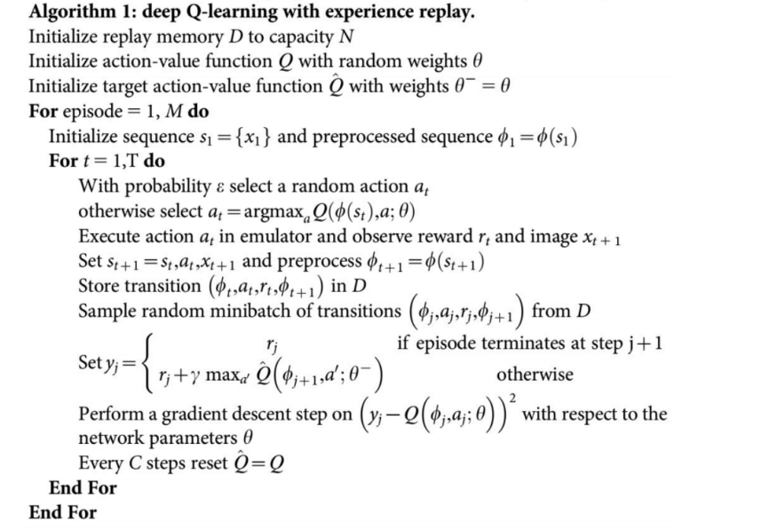
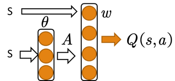

# RL

### DQN

+ 
+ replay_buffer：将历史transition: $(s_t,a_t,r_t,s_{t+1})$保存在一个buffer里，在进行梯度更新时，从buffer里抽样出一个batch，由于q-learning的历史信息是时序相关的，随机抽取一个batch来进行更新可以减小误差。
+ 使用两个网络Q和Q‘，Q每次迭代都在更新，每k次将Q的网络参数赋值给Q'，Q'是学习的目标，从而缓解了训练不稳定的问题。
+ 标签$y_i$其实就是 $r_{t}+\gamma\max_{a'} Q’(s_{t+1},a')$，使用mseloss $(y_i-Q(s_i,a_i))^2$$，来更新网络。

### Double-DQN

+ DDQN有两个网络，一个policy_net（Q）用来选择动作，一个target_net（Q‘）用来评估动作值。每k轮后，将Q的参数复制给Q’。

+ 采样出batch后，计算目标值与DQN不同：
  $$
  y_i=R_i+\gamma Q'(s_{t+1},\arg\max_{a'} Q(s_{t+1},a'))
  $$
  白话：用Q网络给出他认为在$s_{t+1}$下的最优动作$a^*$，然后计算出Q‘在$(s_{t+1},a^*)$的动作值，即用Q’来评估Q。更新网络同样用mseloss。

### DDPG

+ Actor-Critic架构：

  + Actor网络：输入状态state，输出一个动作action
  + Critic网络：输入状态state和动作action，输出一个实数Q(s,a)
  + 白话：Actor是一个策略，根据state给出action，而Critic就类似与策略评估，输入(state,action)输出（可以是动作值或优势函数或TD残差）来告诉Actor做得好不好

  

+ 

+ actor网络：$\mu,\mu'$，critic网络：$Q,Q'$。在每一个episode的每一步，通过actor网络和随机噪声结合选择一个动作$a=\mu(state)+\mathcal{N}$,存储transition:$(s_i,a_i,r_i,s_{i+1})$。因为critic网络就是动作值函数，所以通过优化mseloss来更新其参数。其中，标签
  $$
  y_i=r_i+\gamma Q'(s_{i+1},\mu'(s_{i+1}))
  $$
  actor $\mu$网络的更新：梯度由DPG定理给出，其loss其实可以写为$-\frac{1}{N}\sum_{j=1}^N Q(s_j,a_j|\theta)$。即$-Q(s_j,\mu(s_j))$的平均值。由链式法则可知其梯度就等于伪代码中的。

  最后，将policy网络的参数，soft update给target网络的参数。