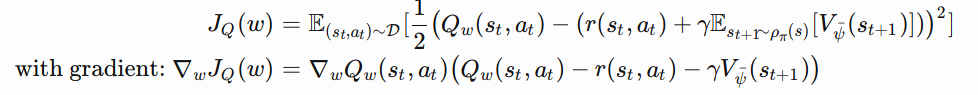

# RL

### DQN

+ 
+ replay_buffer：将历史transition: $(s_t,a_t,r_t,s_{t+1})$保存在一个buffer里，在进行梯度更新时，从buffer里抽样出一个batch，由于q-learning的历史信息是时序相关的，随机抽取一个batch来进行更新可以减小误差。
+ 使用两个网络Q和Q‘，Q每次迭代都在更新，每k次将Q的网络参数赋值给Q'，Q'是学习的目标，从而缓解了训练不稳定的问题。
+ 标签$y_i$其实就是 $r_{t}+\gamma\max_{a'} Q’(s_{t+1},a')$，使用mseloss $(y_i-Q(s_i,a_i))^2$，来更新网络。

### Double-DQN

+ DDQN有两个网络，一个policy_net（Q）用来选择动作，一个target_net（Q‘）用来评估动作值。每k轮后，将Q的参数复制给Q’。

+ 采样出batch后，计算目标值与DQN不同：
  $$
  y_i=R_i+\gamma Q'(s_{t+1},\arg\max_{a'} Q(s_{t+1},a'))
  $$
  用Q网络给出他认为在$s_{t+1}$下的最优动作$a^*$，然后计算出Q‘在$(s_{t+1},a^*)$的动作值，即用Q’来评估Q。更新网络同样用mseloss。

### DDPG

+ Actor-Critic架构：

  + Actor网络：输入状态state，输出一个动作action
  + Critic网络：输入状态state和动作action，输出一个实数Q(s,a)
  

  
+ 

+ actor网络：$\mu,\mu'$，critic网络：$Q,Q'$。在每一个episode的每一步，通过actor网络和随机噪声结合选择一个动作$a=\mu(state)+\mathcal{N}$,存储transition:$(s_i,a_i,r_i,s_{i+1})$。因为critic网络就是动作值函数，所以通过优化mseloss来更新其参数。其中，标签
  $$
  y_i=r_i+\gamma Q'(s_{i+1},\mu'(s_{i+1}))
  $$
  actor $\mu$网络的更新：梯度由DPG定理给出，其loss其实可以写为$-\frac{1}{N}\sum_{j=1}^N Q(s_j,a_j|\theta)$。即$-Q(s_j,\mu(s_j))$的平均值。由链式法则可知其梯度就等于伪代码中的。

  最后，将policy网络的参数，soft update给target网络的参数。

### SAC

+ Maximum Entropy RL:

  + 一般DRL学习一个policy使得期望奖赏最大，而MERL还需要使得policy输出的action的熵最大。
    $$
    \pi^*=\arg\max_\pi\mathbb{E}_{(s_t,a_t)\sim\rho_\pi}[\sum_t R(s_t,a_t)+\alpha H(\pi(\cdot|s_t))]\\
    H(X)=-\sum_i P(x_i)\log P(x_i)=-\mathbb{E}_x [\log P(x)]
    $$
    当X为均匀分布时，熵H最大，即尽可能让策略随机化：stochastic policy

    因此，计算reward时，需要把熵加上：$$q(s,a)+(-\log\pi(a|s))$$。其实，
    $$
    R=r(s_t,a_t)+\gamma \alpha\mathbb{E}_{s_{t+1}\sim\rho }H(\pi(\cdot|s_{t+1}))
    $$
    代入bellman方程就可得到
    $$
    Q_{soft}(s_t,a_t)=r(s_t,a_t)+\gamma \mathbb{E}_{s_{t+1},a_{t+1}}[Q_{soft}(s_{t+1},a_{t+1})-\alpha\log(\pi(a_{t+1}|s_{t+1}))]\\
    V_{soft}(s_t)=\mathbb{E}_{a_t\sim\pi}[Q_{soft}(s_t,a_t)-\alpha\log\pi(a_t|s_t)]
    $$
    此公式为soft policy evaluation。

    policy improvement：将策略限定在一个集合中，使用KL散度去投影新的策略
    $$
    \pi_{new}=\arg\min D_{KL}(\pi'(\cdot|s_t)||\frac{\exp(Q^{\pi_{old}}(s_t,\cdot))}{Z^{\pi_{old}}(s_t)})
    $$
    Z用来归一化。

  + 我们用参数化的值函数 $V_{\psi}(s_t)$，soft Q函数 $Q_\theta(s_t,a_t)$，策略$\pi_{\phi}(a_t|s_t)$，其中策略用神经网络表示的高斯分布。

    值函数和Q函数是有关系的，因此我们没有必要去估计值函数，**但是在实际操作中发现用单独的网络估计值函数可以稳定训练**，它的mseloss是：

    

    soft Q函数通过最小化 soft Bellman residual:

    

    其中$\overline{\psi}$为target网络的参数，just like how the parameter of the target Q network is treated in DQN stabilize the training。

    策略参数可以通过最小化公式中的KL散度来获得，

    

    $J_\pi(\theta)$后多了一个梯度算子。Z为归一化函数，与参数无关。用**reparameterization trick来采样动作**：$a_t=f_\phi(\epsilon_t;s_t)$，$\epsilon_t$为一个单位高斯分布，f是一个关于$\phi$的表达式。从而对a求积分变为对$\epsilon$求积分：

    

    从而可以求导：

    

+ 

